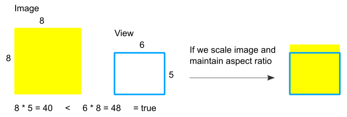
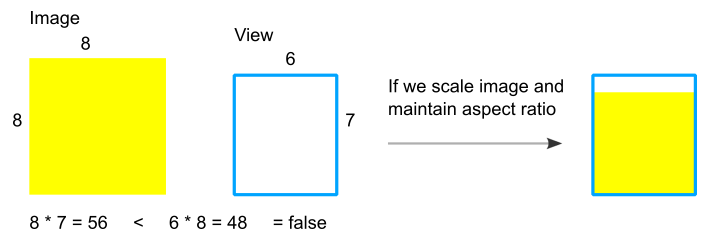

Welcome back, now I want to explain about how to create a parallax effect for ImageView when it's being scrolled. Before we go any further let's see how it's gonna be.

<!--more-->

{:.rounded .center}

## Concept
The idea behind this is that we want to transform content of the ImageView when this ImageView is being scrolled. technically Canvas of the ImageView is transformed using some kind of transformation logic (in this case parallax) before rendered

So we end up with quite simple implementation of this new child of ImageView

We would extend ImageView and implement ViewTreeObserver.OnScrollChangedListener interface because we want to be informed when this view moved/scrolled on the screen.

```kotlin
open class ScrollTransformImageView : ImageView, ViewTreeObserver.OnScrollChangedListener {

    private val viewLocation : IntArray = IntArray(2)

    var viewTransformer : ViewTransformer? = null
        set(value) {
            field?.onDetached(this)
            field = value
            field?.onAttached(this)
        }
    var enableTransformer : Boolean = true

    constructor(ctx: Context) : super(ctx)
    constructor(ctx: Context, attributeSet: AttributeSet) : super(ctx, attributeSet)

    override fun onAttachedToWindow() {
        super.onAttachedToWindow()
        viewTreeObserver.addOnScrollChangedListener(this)
    }

    override fun onDetachedFromWindow() {
        super.onDetachedFromWindow()
        viewTreeObserver.removeOnScrollChangedListener(this)
    }

    override fun onDraw(canvas: Canvas) {
        if (enableTransformer) {
            getLocationInWindow(viewLocation)
            viewTransformer?.apply(this, canvas, viewLocation[0], viewLocation[1])
        }
        super.onDraw(canvas)
    }

    override fun onScrollChanged() {
        if (enableTransformer) invalidate()
    }
}
```

We have a state called enableTransformer which tell if we need to transform (in this case do parallax) the canvas view or not. Also we have viewTransformer of type ViewTransformer which would do a transformation.
Here onScrollChanged() method would be called when the view scrolled and if enableTransformer is true invalidate() it, in other words do transformation and redraw the image.

## Transformer

Extend this class to implement any transformation we want.

```kotlin
abstract class ViewTransformer {

    /**
     * This will be called when it's being set into the ScrollTransformImageView
     */
    open fun onAttached(view : ScrollTransformImageView) {}

    /**
     * This will be called when it's being removed or replaced by other viewTransformer
     * from the ScrollTransformImageView
     */
    open fun onDetached(view : ScrollTransformImageView) {}

    /**
     * apply will be called every time the view scrolled and before rendered
     */
    abstract fun apply(view: ScrollTransformImageView, canvas: Canvas, viewX : Int, viewY : Int)

    /**
     * Convert top,left (0,0) coordinate
     * to the middle of the screen
     */
    protected fun centeredX(x : Int, viewWidth : Int, screenWidth : Int) = x + (viewWidth / 2) - (screenWidth / 2)
    protected fun centeredY(y : Int, viewHeight : Int, screenHeight : Int) = (screenHeight / 2) - (y + (viewHeight / 2))
}
```

## Writing Vertical Parallax Effect

In this class we implement the logic to do vertical parallax transformation like in the demo animation above.

```kotlin
class VerticalParallaxTransformer : ViewTransformer() {

    override fun onAttached(view: ScrollTransformImageView) {
        view.scaleType = ImageView.ScaleType.CENTER_CROP
    }

    override fun apply(view: ScrollTransformImageView, canvas: Canvas, viewX : Int, viewY : Int) {
        if (view.scaleType == ImageView.ScaleType.CENTER_CROP) {
            val imageWidth = view.drawable.intrinsicWidth
            val imageHeight = view.drawable.intrinsicHeight

            val viewWidth = view.width - view.paddingLeft - view.paddingRight
            val viewHeight = view.height - view.paddingTop - view.paddingBottom

            val deviceHeight = view.resources.displayMetrics.heightPixels

            // If this view is off screen we wont do anything
            if (viewY < -viewHeight || viewY > deviceHeight) return

            if (imageWidth * viewHeight < viewWidth * imageHeight) {
                val scale = viewWidth.toFloat() / imageWidth.toFloat()
                val invisibleVerticalArea = imageHeight * scale - viewHeight

                val y = centeredY(viewY, viewHeight, deviceHeight)
                val translationScale = invisibleVerticalArea / (deviceHeight + viewHeight)
                canvas.translate(0f, y * translationScale)
            }
        }
    }
}
```

Make this ImageView always maintain aspect ratio by

```kotlin
override fun onAttached(view: ScrollTransformImageView) {
    view.scaleType = ImageView.ScaleType.CENTER_CROP
}
```

What going on in this code?
```kotlin
if (imageWidth * viewHeight < viewWidth * imageHeight) {
	// scale factor based on the width
	val scale = viewWidth.toFloat() / imageWidth.toFloat()

    // explained below
	val invisibleVerticalArea = imageHeight * scale - viewHeight

	// y is how much the distance between viewY and the center of the screen (deviceHeight)
	val y = centeredY(viewY, viewHeight, deviceHeight)
	val translationScale = invisibleVerticalArea / (deviceHeight + viewHeight)
	canvas.translate(0f, y * translationScale)
}
```

`if (imageWidth * viewHeight < viewWidth * imageHeight){ //... }`, this check means that we can only moves the image/canvas vertically (parallax) when the aspect ratio of image is look like more portrait than aspect ratio of the view. why?

For example we have image 8x8 and view 6x5, and it turns out when we scale the image down to fit the size of view, there is an invisible area of image left, that means we can translate this area up & down



But when the aspect ratio of view is more portrait (tall) we don't have any invisible area, instead there is blank area inside a view (which is not what we want)



## Writing Horizontal Parallax Effect

Horizontal parallax effect is the same as vertical just reverse the logic from vertical to horizontal

```kotlin
class HorizontalParallaxTransformer : ViewTransformer() {

    override fun onAttached(view: ScrollTransformImageView) {
        view.scaleType = ImageView.ScaleType.CENTER_CROP
    }

    override fun apply(view: ScrollTransformImageView, canvas: Canvas, viewX : Int, viewY : Int) {
        if (view.scaleType == ImageView.ScaleType.CENTER_CROP) {
            val imageWidth = view.drawable.intrinsicWidth
            val imageHeight = view.drawable.intrinsicHeight

            val viewWidth = view.width - view.paddingLeft - view.paddingRight
            val viewHeight = view.height - view.paddingTop - view.paddingBottom

            val deviceWidth = view.resources.displayMetrics.widthPixels

            if (viewX < -viewWidth || viewX > deviceWidth) return

            if (imageWidth * viewHeight > viewWidth * imageHeight) {
                val scale = viewHeight.toFloat() / imageHeight.toFloat()
                val invisibleHorizontalArea = imageWidth * scale - viewWidth

                val x = centeredX(viewX, viewWidth, deviceWidth)
                val translationScale = invisibleHorizontalArea / (deviceWidth + viewWidth)
                canvas.translate(-x * translationScale, 0f)
            }
        }
    }

}
```